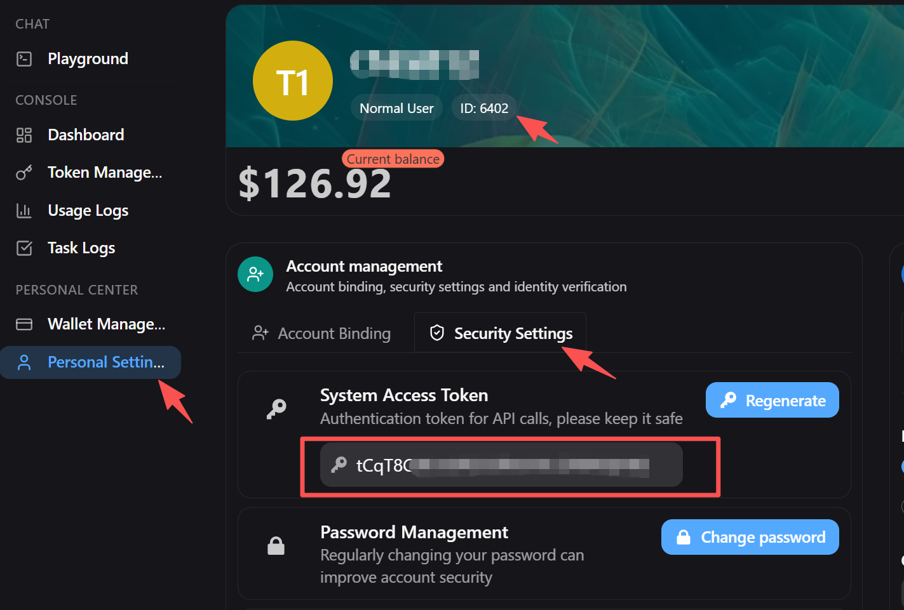

# New API Balance Orb

<p align="center">
  <strong>简体中文</strong> |
  <a href="./README.md">English</a>
</p>

New API Balance Orb 是一个基于 Tauri v2 的 Windows 桌面小部件，用于在一个紧凑窗口中同时跟踪多个 New API 兼容账户余额。

<p align="center">
  
</p>

## 关于 New API

[New API](https://github.com/QuantumNous/new-api) 是一个下一代 LLM 网关和 AI 资产管理系统，提供统一的 OpenAI 兼容 API，支持多种 AI 模型，具备渠道路由、用量分析、成本核算和组织级访问控制等功能。

本小部件专为配合 New API 部署使用而设计。使用前需要一个有效的 New API 实例和账户。

## 多站点余额

凭据和 API 端点不会存储在本仓库中。

可以配置一个或多个 New API 兼容站点。每个站点都可以独立设置：

- 显示名称，可留空并自动使用接口域名前缀
- API 端点，例如兼容 `GET /api/user/self` 的端点
- 来自服务商安全设置的 Access Token
- 来自服务商账户的 User ID
- 刷新间隔（秒）

<p align="center">
  
</p>

应用会将这些值保存在本机的 Tauri 应用配置目录中。旧版单站点配置会自动迁移到当前的多站点格式。

## 自动更新

正式版通过 GitHub Releases 使用 Tauri 签名更新器：

```text
https://github.com/coderDJing/new-api-balance-orb/releases/latest/download/latest.json
```

更新器公钥存储在 `src-tauri/tauri.conf.json` 中。对应的私钥仅保存在本地：

```text
C:\Users\coder\.tauri\ai-balance-orb.key
```

请勿提交私钥或将其粘贴到 issue/release 文本中。GitHub Actions 需要以下仓库密钥来生成签名更新器产物：

- `TAURI_SIGNING_PRIVATE_KEY`
- `TAURI_SIGNING_PRIVATE_KEY_PASSWORD`

当前私钥没有密码，密码密钥可以为空或省略。

## 开发

```bash
pnpm install
pnpm tauri:dev
```

## 桌面构建

在目标平台上构建：

```bash
pnpm tauri:build
```

仓库包含用于 Windows 构建的 GitHub Actions。

## 发布

发布版本必须在 `package.json`、`src-tauri/Cargo.toml` 和 `src-tauri/tauri.conf.json` 中保持同步。

在仓库根目录运行发布脚本：

```powershell
.\scripts\release.ps1 0.1.1
```

脚本会验证 `master` 分支是否干净，更新三个版本文件，运行 `pnpm build`、`pnpm check:desktop` 和本地签名调试 NSIS 更新器构建，提交版本变更，创建 `v0.1.1` 标签，并推送 `master` 和标签。推送 `v*` 标签会触发 `.github/workflows/release.yml`，构建并发布包含安装程序、签名和 `latest.json` 的 Windows GitHub Release。

发布工作流配置：

- `releaseDraft: false`
- `prerelease: false`
- `updaterJsonPreferNsis: true`
- `args: --ci`

## 验证

```bash
pnpm build
pnpm check:desktop
```

签名更新器产物冒烟测试：

```powershell
$env:TAURI_SIGNING_PRIVATE_KEY = Get-Content -Raw "C:/Users/coder/.tauri/ai-balance-orb.key"
pnpm tauri build --debug --bundles nsis --ci
```

预期的调试构建产物：

```text
src-tauri/target/debug/bundle/nsis/*.exe
src-tauri/target/debug/bundle/nsis/*.exe.sig
```
